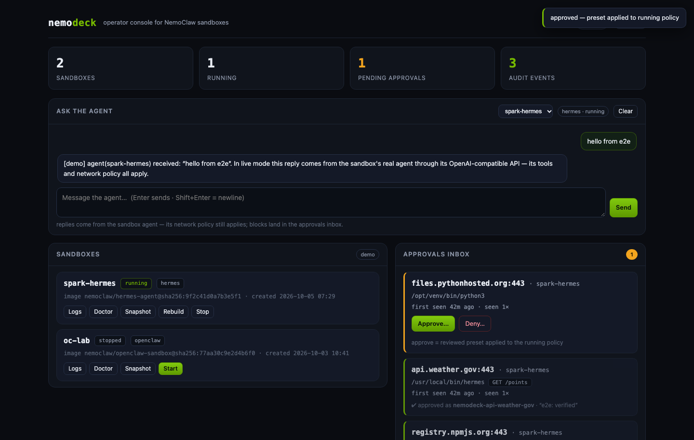

# nemodeck

**The operator console NemoClaw doesn't ship.** Approvals inbox, policy promotion, lifecycle, and an append-only audit trail for [NVIDIA NemoClaw](https://github.com/NVIDIA/NemoClaw) sandboxes — driven entirely through the real `nemoclaw` / `openshell` CLIs.



## Why this exists

NemoClaw runs always-on agents inside OpenShell sandboxes with **deny-by-default egress**: when an agent reaches an unlisted host, OpenShell blocks it and surfaces the request to the operator for a real-time decision in the `openshell term` TUI.

That loop has four sharp edges:

1. **It's terminal-bound.** Approvals only exist in an interactive TUI on the host — not from your phone on the tailnet, not for a teammate.
2. **It's session-scoped.** Approvals reset to baseline when a sandbox is destroyed/recreated. Approve the same endpoint twice, and the docs themselves tell you it belongs in policy — but nothing helps you get there.
3. **It leaves no trail.** No record of *who* allowed *what*, *when*, or *why*.
4. **Lifecycle is scattered.** Status, logs, rebuild, snapshots, doctor — all separate commands, no single deck.

nemodeck closes the loop: a web approvals inbox with reasons, an fsync'd audit log, one-click promotion of any approval into a least-privilege **custom policy preset** applied through the documented `nemoclaw <name> policy add --from-file` flow, plus the lifecycle buttons you always SSH for.

## What you get

- **Approvals inbox** — every blocked egress request (host, port, requesting binary, method/path, first seen, seen count), with **Approve…** / **Deny…** and a mandatory reason. Approve shows you the *exact* preset YAML (editable) that will be applied — nothing is a bare "yes".
- **Least-privilege by construction** — the generated preset scopes host + port + method + path + binary. Unknown binaries are refused until you set the exact path `openshell term` reports.
- **Audit trail** — append-only JSONL, `fsync` per entry: approve, deny, policy ops, lifecycle ops, with operator notes. Export-friendly, grep-friendly.
- **Lifecycle deck** — per-sandbox status, logs (streamed), rebuild, recover, snapshots, doctor — outputs stream straight into the UI.
- **Two adapters** — `live` (real CLI) and `demo` (a stateful simulator that exercises the same code path, for development, demos, and CI).
- **Zero secrets** — nemodeck never displays, stores, or proxies credentials. Credential custody stays where it belongs: OpenShell.

## Quickstart

Requires Python 3.10+.

**Try it with no NemoClaw install (simulator):**

```bash
python -m venv .venv && . .venv/bin/activate
pip install -e .
python -m nemodeck serve --adapter demo
# → http://127.0.0.1:8787/
```

**Run it on your NemoClaw host (real sandboxes):**

```bash
pip install -e .
python -m nemodeck serve --adapter live
```

**Share it over a private network (tailnet / VPN) — never the public internet:**

```bash
python -m nemodeck serve --adapter live --host 0.0.0.0 --port 8787
# non-loopback binds force an operator token; it is generated and printed once
```

## How it works

```
┌──────────────────────────────  nemodeck  ──────────────────────────────┐
│  web console (single static page, no CDN, no build step)               │
│      │ REST + SSE                                                      │
│  FastAPI service ──── Deck (merge, decisions, audit)                   │
│      │                        │                                        │
│  StateStore (JSON)      AuditLog (JSONL, fsync)                        │
│      │                                                                 │
│  Adapter: live ── argv-only subprocesses ──▶ nemoclaw / openshell CLI  │
│           demo ── in-memory simulator (same interface)                 │
└─────────────────────────────────────────────────────────────────────────┘
```

**The approve path, concretely:**

1. Blocked flows are discovered by parsing `nemoclaw <name> logs` (the same output `openshell term` surfaces), deduped by `(sandbox, host, port, binary)`.
2. Approve opens with the generated, editable preset:

   ```yaml
   preset:
     name: nemodeck-api-weather-gov
     description: "nemodeck approval — api.weather.gov:443 for spark-hermes"
   network_policies:
     nemodeck-api-weather-gov:
       name: nemodeck-api-weather-gov
       endpoints:
         - host: api.weather.gov
           port: 443
           protocol: rest
           enforcement: enforce
           rules:
             - allow: { method: "GET", path: "/points" }
       binaries:
         - { path: /usr/local/bin/hermes }
   ```

3. Applying runs `NEMOCLAW_NON_INTERACTIVE=1 nemoclaw <name> policy add --from-file <file> --yes`, then records the decision.
4. Deny is recorded and the endpoint stays blocked.

**Safety model:**

- subprocess argv lists only — sandbox names and operator input never touch a shell
- mutations use `NEMOCLAW_NON_INTERACTIVE=1` (the documented equivalent of `--yes`) so nothing can hang on a prompt
- loopback bind by default; non-loopback requires a token (Bearer / `X-Nemodeck-Token` / `?token=`)
- per-command timeouts everywhere; streamed ops are killed at their deadline
- no credential values are ever read into the process, displayed, or stored

## CLI

```
nemodeck serve   [--adapter demo|live] [--host H] [--port P] [--token T]
                 [--state-dir DIR] [--cli nemoclaw|nemohermes]
nemodeck selftest [--adapter demo|live]      # probe + inventory, no server
```

Operator state lives in `~/.nemodeck/` (`state.json`, `audit.jsonl`, `presets/`).

## Development

```bash
make venv     # uv-based dev environment
make test     # pytest — unit, service, API, SSE
.venv/bin/python scripts/e2e_check.py   # headless-browser E2E against a running console
.venv/bin/python tools/make_preview.py  # standalone interactive UI snapshot (no server)
```

Layout: `nemodeck/adapters/` (live + demo backends), `nemodeck/service.py` (operator logic), `nemodeck/discovery.py` (blocked-egress log parsing), `nemodeck/runner.py` (safe subprocess), `nemodeck/web/index.html` (the console).

## Roadmap

- OpenShell gateway SDK adapter (structured events instead of log parsing) once the SDK surface stabilizes
- One-click "promote approved endpoint into the baseline policy" with a copy-ready blueprint diff
- Multi-host fleet view (one deck, many NemoClaw hosts) via agent-less remoting
- MCP server surface so agents can surface requests into the inbox

## Disclaimer

Community project, not affiliated with or endorsed by NVIDIA. NemoClaw and OpenShell are NVIDIA projects; nemodeck drives their public CLIs and follows their documented policy flows. Alpha software — review it against your own security requirements before production use.

License: [Apache-2.0](LICENSE).